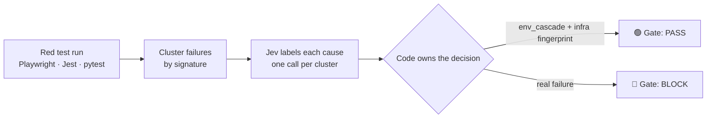

# Latch

### Your CI is red. Is it your code — or the environment?

Latch reads a finished test run and returns **one verdict before you merge**:

| Verdict | What it means |
|---|---|
| 🟢 **`Gate: PASS`** | It's the environment. Ignore it, merge. |
| 🔴 **`Gate: BLOCK`** | It's a real failure. Don't merge. |

[](https://github.com/CaseReed/latch/actions/workflows/ci.yml)
[](LICENSE)
[](package.json)

Read-only · no test rewrite · works with the runner you already use.

```bash
npm install && npm run demo        # no key, no network, ~10 seconds
```

---

## How it works



Clustering and the final decision are **code**. The model only supplies judgment, and never gets to say "ignore" on its own.

## Why teams use it

| Without Latch | With Latch |
|---|---|
| Red build → dig through logs → guess | Red build → one line → merge or don't |
| "Is it infra again?" | `Gate: PASS` |
| "Please don't be my bug" | `Gate: BLOCK` |

A red E2E suite costs you twice: half an hour working out whether it's real, or a habit of ignoring red — until the day you merge a real bug.

**Who it's for**: teams running Playwright (or Jest / pytest) on CI whose suite goes red several times a week for reasons that are not the code.

## See it

```bash
$ npm run demo

=== 1) an infra outage (8 identical connection errors) ===
Latch: 8 failed → 1 cause
P0 env_cascade n=8 conf=1.00 same_root=0.90 blocks=0.40  action=ignore_as_infra (env_cascade) [cached]  [new]
Gate: PASS (no blocking cluster)                    # exit 0 — merge

=== 2) a real regression (5 failing assertions) ===
Latch: 5 failed → 1 cause
P0 assertion_bug n=5 conf=1.00 same_root=0.80 blocks=0.60  action=fix_product (assertion_bug) [cached]  [new]
Gate: BLOCK — 1 cluster to look at                  # exit 1 — do not merge
```

## What you get

- **A verdict, not a dashboard** — `PASS` or `BLOCK`, per run.
- **One line per cause** — infra outage, flaky test, moved locator, wrong assertion.
- **Memory** — `[seen x12, flake 40%]`: this cluster keeps coming back.
- **A filter for known noise** — suppress a cluster once, it stops blocking.
- **No silent ignores** — `ignore_as_infra` requires an explicit network fingerprint.

## Install

```ts
// playwright.config.ts
reporter: [["list"], ["./src/reporter.ts"]]
```

One key in `.env`: `TYPESAFE_API_KEY`. Missing key still prints clusters (`needs_human` / `no_key`) and never fails Playwright.

Optional: `LATCH_MODEL` (default `jev-latest`), `LATCH_STORE` (ledger path), `LATCH_INPUT_USD_PER_MTOK`, `LATCH_OUTPUT_USD_PER_MTOK` (cost estimate only).

Then gate your CI:

```bash
npm run latch -- junit.xml --gate          # exit 1 when a real failure blocks
```

`latch` reads a JUnit XML report (or a `{ run, attempts }` JSON). The reporter itself never fails Playwright, so the gate exit code is a separate CI step.

<details>
<summary><b>Reference</b> — gate, any runner, ledger, policy, proof</summary>

### Merge gate

`--gate` exits non-zero when a reported cluster is **not** confirmed infra noise. `ignore_as_infra` and suppressed clusters pass; `fix_product`, `fix_test` and `needs_human` block. The reporter itself never fails Playwright — the gate exit code belongs to the CLI, so CI runs it as its own step.

### Any runner (JUnit XML)

```bash
npm run latch -- testdata/junit/jest.xml     # or any .xml / golden .json
```

`apiName` comes from Playwright patterns, else the failure `type`, else the exception name in the message; the concise `message` is preferred over the traceback so a test name cannot leak into the signature. Measured live: jest `5 → 2`, pytest `3 → 2`; `go.xml` is the canary for the limit (no stable message → no collapse).

### Failure ledger

Every run appends its clusters to `.latch/store.json` (override `LATCH_STORE`; empty disables) and labels them from past runs:

```
P0 env_cascade n=4  action=ignore_as_infra (env_cascade)  [seen x2]
P1 assertion_bug n=1  action=fix_product (assertion_bug)  [new]
P2 locator.waitFor n=8  action=fix_test (flake)  [seen x5, flake 40%]
```

Judgments are cached per signature (`[cached]`): a known cluster costs no API call, does not count against the 8-call cap, and a known run reports with no key at all. The store is written atomically.

### Policy (code owns the decision)

1. No key / API error → `needs_human`
2. `cause.confidence < 0.55` → `needs_human`
3. `same_root < 0.5` → `needs_human`
4. `env_cascade` + `same_root >= 0.7` + an infra fingerprint → `ignore_as_infra`; otherwise `needs_human`
5. `flake` and `flaky_count >= 1` → `fix_test`
6. `locator_drift` → `fix_test`
7. `assertion_bug` and (`blocks_merge >= 0.55` or Jev `action = fix_product`) → `fix_product`
8. else → `needs_human`

Thresholds are calibrated (`npm run calibrate`); `blocks_merge` sits in a noise band ~±0.03 and 0.55 falls in the empty gap, so the verdict does not flip.

### Proof

```bash
npm run test:unit        # goldens, policy, ledger, ingestion — no network
npm run test:e2e         # real Playwright, intentional failures
npm run test:stability   # signature drift over repeated runs
npm run calibrate        # verdict flip rate (needs a key)
npm run test:live        # Jev on goldens (needs a key)
npm run demo             # offline merge-gate demo
```

</details>

## Good at — and not yet

- ✅ **Good at**: collapsing an infra cascade (70 identical connection errors → **1** cause) and refusing to silently ignore a non-infra failure.
- ⚠️ **Not yet**: grouping a logic regression whose many tests fail with *different* assertion messages — those fragment into separate clusters. Measured, not hidden: [`experiments/click-real`](experiments/click-real).

## Limits

- Grouping is message-based, so a logic regression fragments. On `pallets/click`: 2 real regressions → 13 failures → **10 clusters**. The "70 → 1" figure is an infra-cascade property, not a general one.
- Signature = `apiName` + first 80 chars of the normalized error (ANSI/UUID/id tokens/timestamps/durations/pixel diffs stripped, secrets redacted; ports kept as service identity).
- Error text is redacted (tokens, keys, `password=`) in **every** output — terminal, `traces/`, PR comment and the Jev state.
- At most 8 Jev calls per run; cached clusters are free.

## Docs

- [`docs/positioning.md`](docs/positioning.md) — the problem, the wedge, the business model, the risks.
- [`docs/validation-plan.md`](docs/validation-plan.md) — the 30-day plan to prove demand before building more.

## License

MIT — see [LICENSE](LICENSE).
