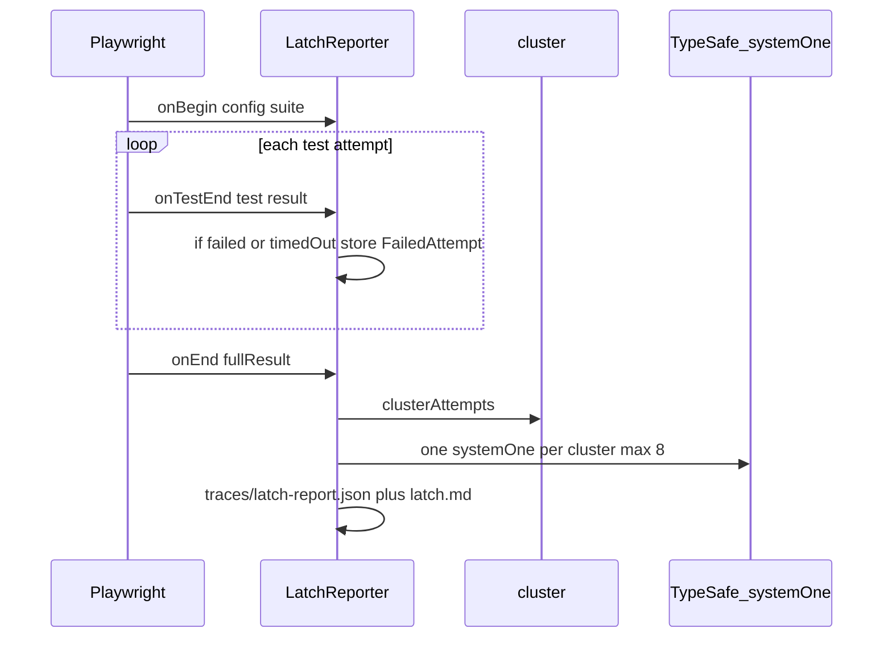

# Latch

Jev judges the failed RUN. Playwright already executed. Code clusters and reports.

Latch is a read-only Playwright reporter. It groups identical failures into clusters, then asks TypeSafe Jev (one `systemOne` per cluster, max 8) what happened. It does not drive the browser, rewrite specs, or click.



## Install (2 minutes)

Node 20+. Put the TypeSafe key in `.env` only — never in code, never `VITE_`, never in chat.

```bash
cp .env.example .env
# TYPESAFE_API_KEY=ts_...
npm install
```

In `playwright.config.ts`:

```ts
reporter: [["list"], ["./src/reporter.ts"]],
```

Then:

```bash
npx playwright test
```

- Green run: `Latch: 0 failures` — no Jev call
- Failures: one line per cluster in the terminal, plus `traces/latch-report.json` and `traces/latch.md`
- Missing key: clusters still print, `action=needs_human` `reason=no_key` — the Playwright run is unchanged

## Offline proof (no network)

```bash
npm run test:unit
npx tsx src/print-clusters.ts testdata/runs/env-cascade.json
```

70 `page.goto` + `net::ERR_CONNECTION_REFUSED` at `http://localhost:8080/` collapse to **one** cluster. Three distinct asserts stay separate: `Latch: 73 failed → 4 causes`.

## Live (optional)

```bash
npm run test:live
```

Skips if `TYPESAFE_API_KEY` is unset. Scores the same golden run with Jev.

## Policy (code, not the model)

1. No key / API error → `needs_human`, cluster still written
2. `cause.confidence < 0.55` → `needs_human`
3. `env_cascade` and `same_root >= 0.7` → `ignore_as_infra`
4. `flake` and `flaky_count >= 1` → `fix_test`
5. `locator_drift` → `fix_test`
6. `assertion_bug` and `blocks_merge >= 0.6` → `fix_product`
7. else → `needs_human`

Never auto-fix. Text only. At most 8 Jev calls; remaining clusters are `unscored`.

## GitHub Actions

If `GITHUB_STEP_SUMMARY` is set, Latch appends the markdown report. A PR comment is posted when `GITHUB_TOKEN`, `GITHUB_REPOSITORY`, and a pull-request ref exist. Those writes never fail the Playwright run.

## Out of scope

Wrapper `test()`, recover / remap / click, Browser Use, a second LLM, production SaaS.
